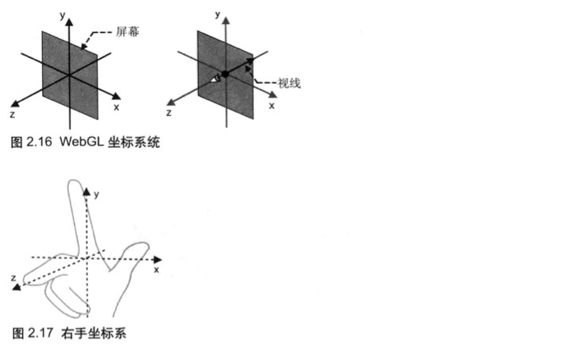

# 第1章 WebGL概述

WebGL是一项用来在网页上绘制和渲染复杂三维图形，并允许用户与之进行交互的技术。

## WebGL的优势

WebGL是内嵌在浏览器中的，允许javascript在网页上显示和操作三维图形，而且编写和发布的流程相对简单。

# 第2章	WebGL入门

## Canvas是什么？

\<canvas\>标签定义了网页上的绘图区域，\<canvas\>提供一些简单的绘图函数，用来绘制点、线、矩形、圆等，可以使用javascript动态的绘制图形。

由于\<cavans\>元素可以灵活地同时支持二维图形和三维图形，它不直接提供绘图方法，而是提供了一种叫上下文(context)的机制来进行绘图。canvas.getContext()方法的参数指定了上下文的类型(二维或三维)。
```javascript
// WebGL清空绘图区
function main() {
  var canvas = document.getElementById("webgl");

  var gl = getWebGLContext(canvas);

  if (!gl) {
    console.error("Failed to get the rendering context for WebGL");
    return;
  }
  // 指定绘图区域的背景色
  gl.clearColor(1.0, 0.0, 0.0, 1.0);
  // 清空颜色缓冲区，将导致WebGL清空页面上的<cavas>区域
  gl.clear(gl.COLOR_BUFFER_BIT);
}
```

### 着色器是什么？

在代码中，着色器程序是以字符串的形式嵌入在javascript文件中的，WebGL需要两种着色器。

- 顶点着色器(Vertex shader)：顶点着色器是用来描述顶点特性(如位置，颜色等)的程序。顶点(Vertex)是指二维或三维空间中的一个点。
- 片元着色器(Fragment shader)：进行逐片元处理过程如光照的程序。片元(fragment)是一个WebGL术语，可以将其理解为像素。

>  齐次坐标：齐次坐标使用如下的符号描述：$(x,y,z,w)$。齐次坐标等价于三维坐标$(x/w,y/w,z/w)$。所以如果齐次坐标的第4个分量是1，你就可以将它当做三维坐标来使用。$w$的值必须是大于等于0的。如果$w$趋近于0，那么它所表示的点将趋近无穷远。三维图形系统在计算过程中，通常使用齐次坐标来表示顶点的三维坐标。

```javascript
// 顶点着色器程序 （GLSL ES）语言
var VSHADER_SOURCE = 
`
  // 运行在WebGL系统中
  void main() {
    // 指定点的位置
    // 类型：vec4
    // 齐次坐标
    gl_Position = vec4(0.0, 0.0, 0.0, 1.0);
    // 指定点的尺寸
    // 类型：float
    gl_PointSize = 10.0;
  }
`;

// 片元着色器程序 （GLSL ES）语言
var FSHADER_SOURCE =
`
  // 运行在WebGL系统中
  void main() {
    // 指定点的颜色
    // gl_FragColor是片元着色器唯一的内置变量
    gl_FragColor = vec4(1.0, 0.0, 0.0, 1);
  } 
`;

// 主程序
function main() {
  var canvas = document.getElementById("webgl");

  var gl = getWebGLContext(canvas);

  if (!gl) {
    console.error("Failed to get the rendering context for WebGL");
    return;
  }
  // 初始化着色器
  if (!initShaders(gl, VSHADER_SOURCE, FSHADER_SOURCE)) {
    console.error("Failed to initialize shaders.");
  }

   // 指定绘图区域的背景色
   gl.clearColor(0.0, 0.0, 0.0, 1.0);

   // 清空颜色缓冲区，将导致WebGL清空页面上的<cavas>区域
   gl.clear(gl.COLOR_BUFFER_BIT);

   // 绘制一个点
   gl.drawArrays(gl.POINTS, 0, 1);
}
```

### WebGL坐标系统

默认情况下，WebGL使用右手坐标系。



### 使用attribute变量

向顶点着色器传递参数有两种方式：__attribute变量__和__uniform变量__。

```javascript
// 顶点着色器程序 （GLSL ES）语言
var VSHADER_SOURCE = 
`
  // attribute 是存储限定符
  attribute vec4 a_Position;
  // 运行在WebGL系统中
  void main() {
    // 指定点的位置
    // 类型：vec4
    // 齐次坐标
    gl_Position = a_Position;
    // 指定点的尺寸
    // 类型：float
    gl_PointSize = 10.0;
  }
`;

// 片元着色器程序 （GLSL ES）语言
var FSHADER_SOURCE =
`
  // 运行在WebGL系统中
  void main() {
    // 指定点的颜色
    // gl_FragColor是片元着色器唯一的内置变量
    gl_FragColor = vec4(1.0, 0.0, 0.0, 1);
  } 
`;

// 主程序
function main() {
  var canvas = document.getElementById("webgl");

  var gl = getWebGLContext(canvas);

  if (!gl) {
    console.error("Failed to get the rendering context for WebGL");
    return;
  }
  // 初始化着色器
  if (!initShaders(gl, VSHADER_SOURCE, FSHADER_SOURCE)) {
    console.error("Failed to initialize shaders.");
  }
  // 获取attribute变量的存储位置,必须在调用initShaders()之后访问gl.program
  var a_Position = gl.getAttribLocation(gl.program, 'a_Position');
  // 如果a_Position === -1,则表示指定的attribute变量不存在
  if (a_Position < 0) {
    console.error("Failed to get the storage location of a_Position");
    return;
  }
  // gl.verteAttrib3f(location, a, b, c)
  // 将数据(a, b, c)传给用location参数指定的attribute变量，a,b,c分布填充attribute变量的第一，二，三个分量的值
  gl.vertexAttrib3f(a_Position, 0.0, 0.0, 0.0);

   // 指定绘图区域的背景色
   gl.clearColor(0.0, 0.0, 0.0, 1.0);

   // 清空颜色缓冲区，将导致WebGL清空页面上的<cavas>区域
   gl.clear(gl.COLOR_BUFFER_BIT);

   // 绘制一个点
   gl.drawArrays(gl.POINTS, 0, 1);
}
```

### WebGL相关函数的命名规范

__gl.vertexAttrib3f(location, a, b, c)__：其中 __gl.vertexAttrib3f__ 是基础函数名，"__3__"是参数个数，"__f__"是参数类型。如果函数名后面跟着一个v，就表示函数也可以接收数组作为参数。在这种情况下，函数名中的数字表示数组中的元素个数。

```javascript
// 顶点着色器程序 （GLSL ES）语言
var VSHADER_SOURCE =
  `
  // attribute 是存储限定符
  attribute vec4 a_Position;
  // 运行在WebGL系统中
  void main() {
    // 指定点的位置
    // 类型：vec4
    // 齐次坐标
    gl_Position = a_Position;
    // 指定点的尺寸
    // 类型：float
    gl_PointSize = 10.0;
  }
`;

// 片元着色器程序 （GLSL ES）语言
var FSHADER_SOURCE =
  `
  // 运行在WebGL系统中
  precision mediump float;
  uniform vec4 u_FragColor;
  void main() {
    // 指定点的颜色
    // gl_FragColor是片元着色器唯一的内置变量
    gl_FragColor = u_FragColor;
  } 
`;

// 主程序
function main() {
  var canvas = document.getElementById("webgl");

  var gl = getWebGLContext(canvas);

  if (!gl) {
    console.error("Failed to get the rendering context for WebGL");
    return;
  }
  // 初始化着色器
  if (!initShaders(gl, VSHADER_SOURCE, FSHADER_SOURCE)) {
    console.error("Failed to initialize shaders.");
  }
  // 获取attribute变量的存储位置,必须在调用initShaders()之后访问gl.program
  var a_Position = gl.getAttribLocation(gl.program, 'a_Position');

  // 获取u_FragColor变量的存储位置
  var u_FragColor = gl.getUniformLocation(gl.program, 'u_FragColor');

  canvas.onmousedown = function (ev) {
    click(ev, gl, canvas, a_Position, u_FragColor);
  };
  // 如果a_Position === -1,则表示指定的attribute变量不存在
  if (a_Position < 0) {
    console.error("Failed to get the storage location of a_Position");
    return;
  }

   // 指定绘图区域的背景色
   gl.clearColor(0.0, 0.0, 0.0, 1.0);

  // 清空颜色缓冲区，将导致WebGL清空页面上的<cavas>区域
  gl.clear(gl.COLOR_BUFFER_BIT);
}

var g_points = []; // 鼠标点击位置数组
var g_colors = []; // 存储点颜色的数组
function click(ev, gl, canvas, a_Position, u_FragColor) {
  var x = ev.clientX;
  var y = ev.clientY;
  var rect = ev.target.getBoundingClientRect();
  x = ((x - rect.left) - canvas.height / 2) / (canvas.height / 2);
  y = (canvas.width / 2 - (y - rect.top)) / (canvas.width / 2);

  // 将坐标存储到g_points中
  g_points.push([x, y]);

  // 将点的颜色存储到g_colors中
  if (x >= 0.0 && y >= 0.0) {
    g_colors.push([1.0, 0.0, 0.0, 1.0]);
  } else if (x < 0.0 && y < 0.0) {
    g_colors.push([0.0, 1.0, 0.0, 1.0]);
  } else {
    g_colors.push([1.0, 1.0, 1.0, 1.0]);
  }

  // 清空canvas
  gl.clear(gl.COLOR_BUFFER_BIT);

  var len = g_points.length;

  for (var i = 0; i < len; i++) {
    var xy = g_points[i];
    var rgba = g_colors[i];

    gl.vertexAttrib3f(a_Position, xy[0], xy[1], 0.0);
    gl.uniform4f(u_FragColor, rgba[0], rgba[1], rgba[2], rgba[3]);
    /**
     * 从向量数组中绘制图元
     * void gl.drawArrays(mode, first, count);
     * mode 指定绘制图元的方式
     * first  指定从哪个点开始绘制
     * count 指定绘制需要使用到多少个点
     */
    gl.drawArrays(gl.POINTS, 0, 1);
  }
}
```

# 第3章 绘制和变换三角形

```javascript
// 顶点着色器程序 （GLSL ES）语言
var VSHADER_SOURCE =
  `
  // attribute 是存储限定符
  attribute vec4 a_Position;
  // 运行在WebGL系统中
  void main() {
    // 指定点的位置
    // 类型：vec4
    // 齐次坐标
    gl_Position = a_Position;
    // 指定点的尺寸
    // 类型：float
    // gl_PointSize = 10.0;
  }
`;

// 片元着色器程序 （GLSL ES）语言
var FSHADER_SOURCE =
  `
  // 运行在WebGL系统中
  precision mediump float;
  uniform vec4 u_FragColor;
  void main() {
    // 指定点的颜色
    // gl_FragColor是片元着色器唯一的内置变量
    gl_FragColor = u_FragColor;
  } 
`;

// 主程序
function main() {
  var canvas = document.getElementById("webgl");

  var gl = getWebGLContext(canvas);

  if (!gl) {
    console.error("Failed to get the rendering context for WebGL");
    return;
  }
  // 初始化着色器
  if (!initShaders(gl, VSHADER_SOURCE, FSHADER_SOURCE)) {
    console.error("Failed to initialize shaders.");
  }
  
  // 设置顶点位置
  var n = initVertexBuffers(gl);
  if (n < 0) {
    console.error("Failed to set the positions of the vertices");
    return;
  }

   // 指定绘图区域的背景色
   gl.clearColor(0.0, 0.0, 0.0, 1.0);

  // 清空颜色缓冲区，将导致WebGL清空页面上的<cavas>区域
  gl.clear(gl.COLOR_BUFFER_BIT);

  gl.drawArrays(gl.TRIANGLES, 0, n);
}

function initVertexBuffers(gl) {
  // 初始化vertices为类型化数组，类型化数组不支持push()和pop()方法
  var vertices = new Float32Array([
    0.0, 0.5, -0.5, -0.5, 0.5, -0.5
  ]);
  var n = 3;

  // 创建缓冲区对象
  var vertexBuffer = gl.createBuffer();
  if (!vertexBuffer) {
    console.error("Failed to create the buffer object");
    return -1;
  }
  
  /**
   * gl.bindBuffer(target, buffer)
   * 允许使用buffer表示的缓冲区对象并将其绑定到target表示的目标上
   * target对象可取值：gl.ARRAY_BUFFER, gl.ELEMENT, ARRAY_BUFFER等
   * gl.ARRAY_BUFFER表示缓冲区对象中包含了顶点的数据
   */
  gl.bindBuffer(gl.ARRAY_BUFFER, vertexBuffer);

  /**
   * gl.bufferData(target, data, usage)
   * 开辟存储空间，向绑定在target上的缓冲区对象中写入数据data
   * target: gl.ARRAY_BUFFER or gl.ELEMENT_ARRAY_BUFFER
   */
  gl.bufferData(gl.ARRAY_BUFFER, vertices, gl.STATIC_DRAW);

  var a_Position = gl.getAttribLocation(gl.program, 'a_Position');

  // 如果a_Position === -1,则表示指定的attribute变量不存在
  if (a_Position < 0) {
    console.error("Failed to get the storage location of a_Position");
    return;
  }
  // 将缓冲区对象分配给a_Position 变量
  gl.vertexAttribPointer(a_Position, 2, gl.FLOAT, false, 0, 0);

  /**
   * gl.enableVertexAttribArray(location)
   * 开启location指定的attribute变量
   */
  gl.enableVertexAttribArray(a_Position);

  return n;
}
```


