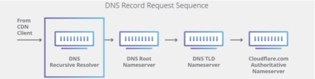

# DNS

https://www.cloudflare.com/zh-cn/learning/dns/what-is-dns/

## 什么是DNS？

域名系统 (DNS) 是 Internet 电话簿。人们通过例如 nytimes.com 或 espn.com 等域名在线访问信息。Web 浏览器通过 Internet 协议 (IP) 地址进行交互。DNS 将域名转换为IP地址，以便浏览器能够加载 Internet 资源。

连接到 Internet 的每个设备都有一个唯一 IP 地址，其他计算机可使用该 IP 地址查找此设备。DNS 服务器使人们无需存储例如 192.168.1.1（IPv4 中）等 IP 地址或更复杂的较新字母数字 IP 地址，例如 2400:cb00:2048:1::c629:d7a2（IPv6 中）。

## DNS如何工作？

DNS 解析过程涉及将主机名（例如 www.example.com）转换为计算机友好的 IP 地址（例如 192.168.1.1）。Internet 上的每个设备都被分配了一个 IP 地址，必须有该地址才能找到相应的 Internet 设备 - 就像使用街道地址来查找特定住所一样。当用户想要加载网页时，用户在 Web 浏览器中键入的内容（example.com）与查找 example.com 网页所需的机器友好地址之间必须进行转换。

为理解 DNS 解析过程，务必了解 DNS 查询必须经过的不同硬件组件。对于 Web 浏览器，DNS 查找在“幕后”进行，除了初始请求外，不需要从用户的计算机进行任何交互。

## 加载网页涉及 4 个 DNS 服务器：

- DNS解析器 -- 该解析器可被视为被要求去图书馆的某个地方查找特定图书的图书馆员。DNS解析器是一种服务器，旨在通过Web浏览器等应用程序接收客户端计算机的查询。然后，解析器一般负责发出其他请求，以便满足客户端的DNS查询。
- 根域名服务器 -- 根域名服务器是将人类可读的主机名转换（解析）为IP地址的第一步。可将其视为指向不同书架的图书馆中的索引，一般将其作为对其他更具体位置的引用。
- TLD域名服务器 -- 顶级域名服务器（TLD）可被视为图书馆中的特定书架。此域名服务器是搜索特定IP地址的下一步，其托管主机名的最后一部分（在example.com中，TLD服务器为"com"）。
- 权威性域名服务器 -- 可将这个最终域名服务器视为书架上的字典，其中特定名称可被转换成其定义。权威性域名服务器是域名服务器查询中的最后一站。如果权威性域名服务器能够访问请求的记录，则其会将已请求主机名的IP地址返回到发出初始请求的DNS解析器（图书管理员）。

## 权威性 DNS 服务器与递归 DNS 解析器之间的区别是什么？

**递归DNS解析器**

递归解析器是一种计算机，其响应来自客户端的递归请求并花时间追踪 [DNS 记录](https://www.cloudflare.com/learning/dns/dns-records/)。为执行此操作，其发出一系列请求，直至到达用于所请求的记录的权威性 DNS 域名服务器为止（或者超时，或者如果未找到记录，则返回错误）。幸运的是，递归 DNS 解析器并不总是需要发出多个请求才能追踪响应客户端所需的记录；[缓存](https://www.cloudflare.com/learning/cdn/what-is-caching/)是一种数据持久性过程，可通过在 DNS 查找中更早地服务于所请求的资源记录来为所需的请求提供捷径。

