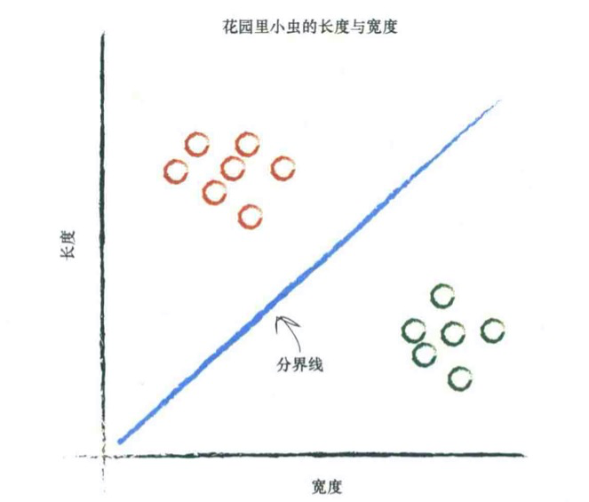
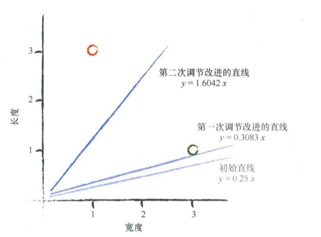
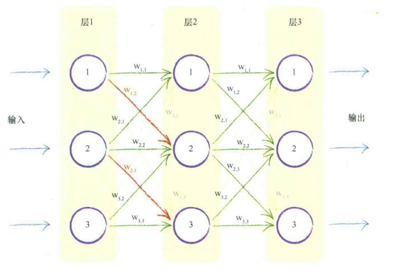
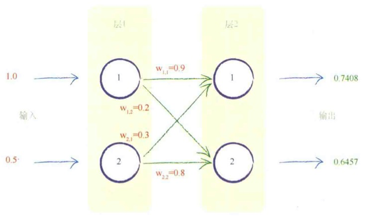
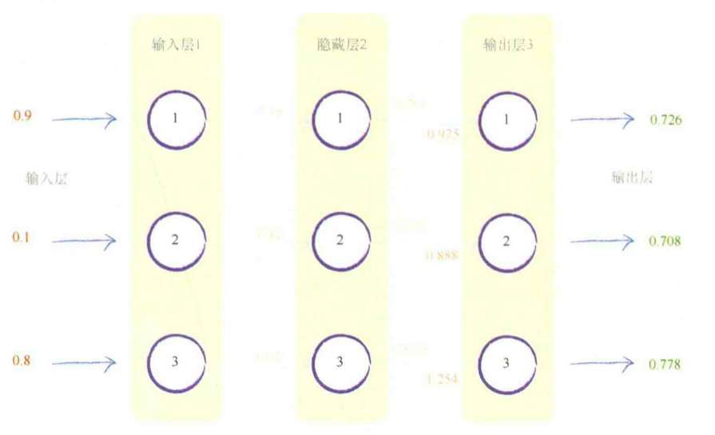
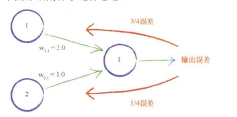
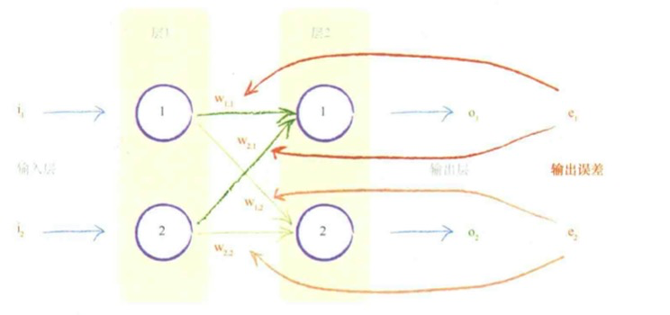
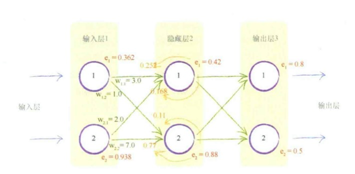
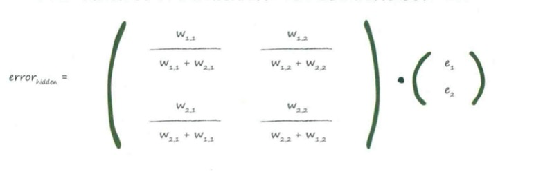
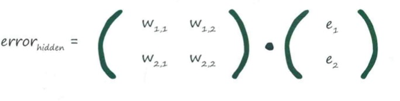

# Python神经网络编程

## 第一章 神经网络如何工作

### 1.1 尺有所短，寸有所长

- 有些任务，对传统的计算机而言很容易，对人类而言却很难。例如，对数百万个数字进行乘法运算。
- 另一方面，有些任务对传统的计算机而言很难，对人类而言却很容易。例如，从一群人的照片中识别出面孔。

### 1.2 一台简单的预测机

- 所有有用的计算机系统都有一个输入和一个输出，并在输入和输出之间进行某种类型的计算。神经网络也是如此。
- 当我们不能精确知道一些事情如何运作时，我们可以尝试使用模型来估计其运作方式，在模型中，包括了我们可以调整的参数。如果我们不知道如何将千米转换为英里，那么我们可以使用线性函数作为模型，并使用可调节的梯度值作为参数。
- 改进这些模型的一种好方法是，基于模型和已知真实示例之间的比较，得到模型偏移的误差值，调整参数。

### 1.3 分类器与预测期并无太大差别

- 可以使用线性函数对数据进行分类。

  

### 1.4 训练简单的分类器

- 我们使用简单的数学，理解了线性分类器输出误差值和可调节斜率参数之间的关系。也就是说，我们知道了在何种程度上调整斜率，可以消除输出误差值。
- 使用朴素的调整方法会出现一个问题，即改进后的模型只与最后一次训练样本最匹配，“有效地”忽略了所有以前的训练样本。解决这个问题的一种好方法是使用学习率，调节改进速率，这样单一的训练样本就不能主导整个学习过程。
- 来自真实事件的训练样本可能充满噪声或包含错误。适度更新有助于限制这些错误样本的影响。

### 1.5 有时候一个分类器不足以解决问题

- 如果数据本身不是由单一线性过程支配，那么一个简单的线性分类器不能对数据进行划分。例如，由逻辑XOR运算符支配的数据说明了这一点。
- 但是解决方案很容易，你只需要使用多个线性分类器来划分由单一直线无法分离的数据。

### 1.6 神经元----大自然的计算器

- 虽然比起现代计算机，生物大脑看起来存储空间少得多，运算速度比较慢，但是生物大脑却可以执行复杂的任务，如飞行、寻找食物、学习语言和逃避天敌。
- 相比于传统的计算机系统，生物大脑对损坏和不完善信号具有难以置信的弹性。
- 由相互连接的神经元组成的生物大脑是人工神经网络的灵感来源。

### 1.7 在神经网络中追踪信号

### 1.8 凭心而论，矩阵乘法大有用途

- 通过神经网络向前馈送信号所需的大量运算可以表示为矩阵乘法。
- 不管神经网络的规模如何，将输入输出表达为矩阵乘法，使得我们可以更简洁的进行书写。
- 更重要的是，一些计算机编程语言理解矩阵计算，并认识到潜在的计算方法的相似性。这允许计算机高速高效地进行这些计算。

### 1.9 使用矩阵乘法的三层神经网络示例

### 1.10 学习来自多个节点的权重

可以使用权重，将误差从输出向后传播到网络中

### 1.11 多个输出节点反向传播误差

### 1.12 反向传播误差到更多层中

- 神经网络通过调整链接权重进行学习。这种方法由误差引导，误差就是训练数据所给出正确答案和实际输出之间的差值。
- 简单地说，在输出节点处的误差等于所需值与实际值之间的差值。
- 然后，与内部节点相关联的误差并不显而易见。一种方法是按照链路权重的比列来分割输出层的误差，然后在每个内部节点处重组这些误差。

### 1.13 使用矩阵乘法进行反向传播误差

- 反向传播误差可以表示为矩阵乘法。

- 无论网络规模大小，这使我们能够简洁地表达反向传播误差，同时也允许理解矩阵计算的计算机语言更高效、更快速的完成工作。

- 这意味着前向馈送信号和反向传播误差都可以使用矩阵计算而变得高效。

  

  

### 1.1.4 我们实际上如何更新权重

- 梯度下降法是求解函数最小值的一种很好的办法，当函数非常复杂困难，并且不能轻易使用数学代数求解函数时，这种方法却发挥了很好的作用。
- 更重要的是，当函数有很多参数，一些其他方法不切实际，或者会得出错误答案，这种方法依然可以适用。
- 这种方法也具有弹性，可以容忍不完善的数据，如果我们不能完美地描述函数，或我们偶尔意外地走错了一步，也不会错得离谱。

