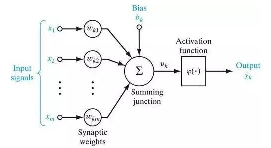

神经网络与机器学习
==

## 导言

### 0.1	什么是神经网络

神经网络是由简单处理单元构成的大规模并行分布式处理器，天然地具有存储经验知识和使之可用的特性。神经网络在两个方面与大脑相似：

1. 神经网络是通过学习过程从外界环境中获取知识的。
2. 互连神经元的连接强度，即突触权值，用于存储获取的知识。

用于完成学习过程的程序称为学习算法，其功能是以有序的方式改变网络的突触权值以获得想要的设计目标。

**神经网络的优点**

神经网络具有下列有用的性质和能力：

1. 非线性(nonlinearity)：人工神经元可以使线性或非线性的。非线性是一个非常重要的特性，特别是当产生输入信号（如语音信号）的内部物力机制是天生非线性的时候。
2. 输入输出映射（input-output mapping）：称之为有教师学习或监督学习(supervised learning)的关于学习的流行方法。它使用带标号的训练样例（traning example）或任务样例（task example）对神经网络的突触权值进行修改。每个样例由一个唯一的输入信号（input signal）和相应的期望响应（desired response）组成。
3. 自适应性（adaptivity）：神经网络具有调整自身突触权值以适应外界环境变化的固有能力。
4. 证据响应（evidential response）：在模式分类问题中，神经网络可以设计成不仅提供选择哪一个特定模式的信息，还提供关于决策的置信度信息。
5. 上下文信息（contextual information）：神经网络的特定结构和记法状态代表知识。
6. 容错性（fault tolerance）：一个以硬件形式实现的神经网络具有天生的容错性。
7. VLSI实现（VLSI implementability）：神经网络的大规模并行性使它具有快速处理某些任务的潜在能力。这一特性使得神经网络很适合使用超大规模集成技术（very-large-scale-integrated）来实现。
8. 分析和设计的一致性：基本上，神经网络作为信息处理器具有通用性。
9. 神经生物类比：神经网络的设计是由与人脑的类比引发的。

### 0.2	人类大脑

人的神经系统可看作三阶段系统：
$$
 \text{刺激}\\
 \Downarrow\\
 \enclose{box}{
 	\text{感受器}
  }\\
  \Downarrow\Uparrow\\
  \enclose{box}{
  	\text{神经网络}
  }\\
  \Downarrow\Uparrow\\
  \enclose{box}{
  	\text{效应器}
  }\\
  \Downarrow\\
  \text{响应}
$$
突触（synapse）或称之为神经末梢（nerve ending），是调节神经元之间相互作用的基本结构和功能单位。

大多数神经元把它们的输出转化成一系列简短的电压脉冲编码。这些脉冲，一般称为动作电位或尖峰，产生于神经元细胞体或其附近并以恒定的电压和振幅穿越个体神经元。

### 0.3	神经元模型

神经元是神经网络操作的基本信息处理单位。神经元模型的三种基本元素：

1. **突触或连接链集**，每一个都由其权值或者强度作为特征。具体来说，在连到神经元$k$的突触$j$上的输入信号$x_j$被乘以$k$的突触权值$w_{kj}$。第一个下标指正在研究的这个神经元，第二个下标指权值所在的突触的输入端。和人脑中的突触不一样，人工神经元的突触权值有一个范围，可以取正值也可以取负值。
2. **加法器**，用于求输入信号被神经元的相应突触加权的和。这个操作构成一个线性组合器。
3. **激活函数**，用来限制神经元输出振幅。由于它将输出信号压制（限制）到允许范围内的一定值，故而激活函数也称为压制函数。通常，一个神经元输出的正常幅度范围可写成单位闭区间$[0,1]$或者另一种区间$[-1,+1]$。

**外部偏置（bias）**

记为$b_k$。偏置$b_k$的作用是根据其为正或为负，相应地增加或降低激活函数的网络输入。

可以用如下一对方程描述神经元$k$：
$$
u_k=\sum_{j=1}^mw_{kj}x_j\\
y_k=\varphi(u_k+b_k)
$$
