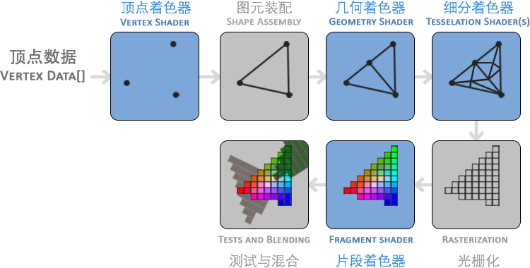

## 图形渲染管线（Pipeline）

图形渲染管线指的是对一些原始数据经过一系列的处理变换并最终把这些数据输出到屏幕上的整个过程。

图形渲染管线的整个处理流程可以被划分为几个阶段，上一个阶段的输出数据作为下一个阶段的输入数据，是一个串行的，面向过程的执行过程。每一个阶段分别在GPU上运行各自的数据处理程序，这个程序就是着色器。

部分着色器允许我们使用着色语言（OpenGL Shading Language）编写自定义的着色器，这样就可以更为细致的控制图像渲染流程中的特定处理过程了，下图是一个图形渲染管线每一个阶段的抽象表示，蓝色部分代表允许自定义着色器。



顶点数据是一些顶点的集合，顶点一般是3维的点坐标组成。


`基本图元（Primitives）`包括点，线段，三角形等，是构成实体模型的基本单位，需要在传入顶点数据的同时通知OpenGL这些顶点数据要组成的基本图元类型。

`顶点着色器（Vertex Shader）`包含对一些顶点属性（数据）的基本处理。

`基本图元装配（Primitive Assembly）`把所有输入的顶点数据作为输入，输出制定的基本图元。

`几何着色器（Geometry Shader）`把基本图元形式的顶点的集合作为输入，可以通过产生新顶点构造出新的（或是其他的）基本图元来生成其他形状。

`细分着色器（Tessellation Shaders）`可以把基本图元细分为更多的基本图形，创建出更加平滑的视觉效果。

`光栅化（Rasterization）`即像素化，把细分着色器输出的基本图形映射为屏幕上网格的像素点，生成供片段着色器处理的片段（Fragment），光栅化包含一个剪裁操作，会舍弃超出定义的视窗之外的像素。

`片段着色器（Fragment Shader）`的主要作用是计算出每一个像素点最终的颜色，通常片段着色器会包含3D场景的一些额外的数据，如光线，阴影等。

`测试与混合`是对每个像素点进行深度测试，Alpha测试等测试并进行颜色混合的操作，这些测试与混合操作决定了屏幕视窗上每个像素点最终的颜色以及透明度。

在整个渲染管线中需要自定义处理的主要是`顶点着色器`和`片段着色器`。

## 顶点缓冲对象（Vertex Buffer Objects，VBO）

`顶点缓冲对象VBO`是在显卡存储空间中开辟出的一块内存缓存区，用于存储顶点的各类属性信息，如顶点坐标，顶点法向量，顶点颜色数据等。在渲染时，可以直接从VBO中取出顶点的各类属性数据，由于VBO在显存而不是在内存中，不需要从CPU传输数据，处理效率更高。

所以可以理解为VBO就是显存中的一个存储区域，可以保持大量的顶点属性信息。并且可以开辟很多个VBO，每个VBO在OpenGL中有它的唯一标识ID，这个ID对应着具体的VBO的显存地址，通过这个ID可以对特定的VBO内的数据进行存取操作。

### **VBO的创建以及配置**

创建VBO的第一步需要开辟（声明/获得）显存空间并分配VBO的ID：

```cpp
	//创建vertex buffer object对象
	GLuint vboId;//vertex buffer object句柄
	glGenBuffers(1, &vboId);
```

创建的VBO可用来保存不同类型的顶点数据,创建之后需要通过分配的ID绑定（bind）一下制定的VBO，对于同一类型的顶点数据一次只能绑定一个VBO。绑定操作通过glBindBuffer来实现，第一个参数指定绑定的数据类型，可以是GL_ARRAY_BUFFER, GL_ELEMENT_ARRAY_BUFFER, GL_PIXEL_PACK_BUFFER或者GL_PIXEL_UNPACK_BUFFER中的一个。

```cpp
	glBindBuffer(GL_ARRAY_BUFFER, vboId);
```

接下来调用glBufferData把用户定义的数据传输到当前绑定的显存缓冲区中。

```cpp
	glBufferData(GL_ARRAY_BUFFER, sizeof(vertices), vertices, GL_STATIC_DRAW);
```

顶点数据传入GPU之后，还需要通知OpenGL如何解释这些顶点数据，这个工作由函数glVertexAttribPointer完成：


```cpp
	glVertexAttribPointer(0, 4, GL_FLOAT, GL_FALSE, 0, 0);
```

- 第一个参数指定顶点属性位置，与顶点着色器中layout(location=0)对应。
- 第二个参数指定顶点属性大小。
- 第三个参数指定数据类型。
- 第四个参数定义是否希望数据被标准化。
- 第五个参数是步长（Stride），指定在连续的顶点属性之间的间隔。
- 第六个参数表示我们的位置数据在缓冲区起始位置的偏移量。

顶点属性glVertexAttribPointer默认是关闭的，使用时要以顶点属性位置值为参数调用glEnableVertexAttribArray开启。如
```cpp
	glEnableVertexAttribArray(0);
```

## 顶点数组对象（Vertex Arrary Object，VAO）

VBO保存了一个模型的顶点属性信息，每次绘制模型之前需要绑定顶点的所有信息，当数据量很大时，重复这样的动作变得非常麻烦。VAO可以把这些所有的配置都存储在一个对象中，每次绘制模型时，只需要绑定这个VAO对象就可以了。

VAO是一个保存了所有顶点数据属性的状态结合，它存储了顶点数据的格式以及顶点数据所需的VBO对象的引用。VAO本身并没有存储顶点的相关属性数据，这些信息是存储在VBO中的，VAO相当于是对很多个VBO的引用，把一些VBO组合在一起作为一个对象统一管理。

### VAO的创建和配置

生成一个VAO对象并绑定：


```cpp
	//创建vertex array object对象   
  GLuint vaoId;//vertext array object句柄
  glGenVertexArrays(1, &vaoId);
  glBindVertexArray(vaoId);
```

执行VAO绑定之后其后的所有VBO配置都是这个VAO对象的一部分，可以说VBO是对顶点属性信息的绑定，VAO是对很多个VBO的绑定。

OpenGL中所有的图形都是通过分解成三角形的方式进行绘制，glDrawArrays函数负责把模型绘制出来，它使用当前激活的着色器，当前VAO对象中的VBO顶点数据和属性配置来绘制出来基本图形。


```cpp
	glDrawArrays (GLenum mode, GLint first, GLsizei count)
```

- 第一个参数表示绘制的类型，有三种取值：
  1.GL_TRIANGLES：每三个顶之间绘制三角形，之间不连接；
  2.GL_TRIANGLE_FAN：以V0V1V2,V0V2V3,V0V3V4，……的形式绘制三角形；
  3.GL_TRIANGLE_STRIP：顺序在每三个顶点之间均绘制三角形。这个方法可以保证从相同的方向上所有三角形均被绘制。以V0V1V2,V1V2V3,V2V3V4……的形式绘制三角形；
- 第二个参数定义从缓存中的哪一位开始绘制，一般定义为0；
- 第三个参数定义绘制的顶点数量；

## 索引缓冲对象（Element Buffer Object，EBO）

索引缓冲对象EBO相当于OpenGL中的顶点数组的概念，是为了解决同一个顶点多次重复调用的问题，可以减少内存空间浪费，提高执行效率。当需要使用重复的顶点时，通过顶点的位置索引来调用顶点，而不是对重复的顶点信息重复记录，重复调用。


EBO中存储的内容就是顶点位置的索引indices，EBO跟VBO类似，也是在显存中的一块内存缓冲器，只不过EBO保存的是顶点的索引。

创建EBO并绑定，用glBufferData（以GL_ELEMENT_ARRAY_BUFFER为参数）把索引存储到EBO中：

```cpp
	GLuint EBO;
	glGenBuffers(1, &EBO);
	glBindBuffer(GL_ELEMENT_ARRAY_BUFFER, EBO);
	glBufferData(GL_ELEMENT_ARRAY_BUFFER, sizeof(indices), indices, GL_STATIC_DRAW);
```

当用EBO绑定顶点索引的方式绘制模型时，需要使用glDrawElements而不是glDrawArrays：


```cpp
	glDrawElements(GL_TRIANGLES, 6, GL_UNSIGNED_INT, 0);
```
- 第一个参数指定了要绘制的模式；
- 第二个参数指定要绘制的顶点个数；
- 第三个参数是索引的数据类型；
- 第四个参数是可选的EBO中偏移量设定。


