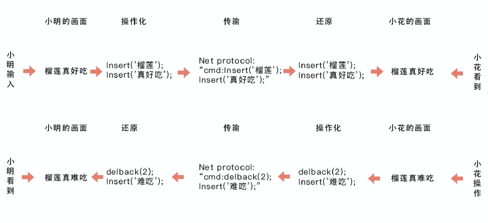
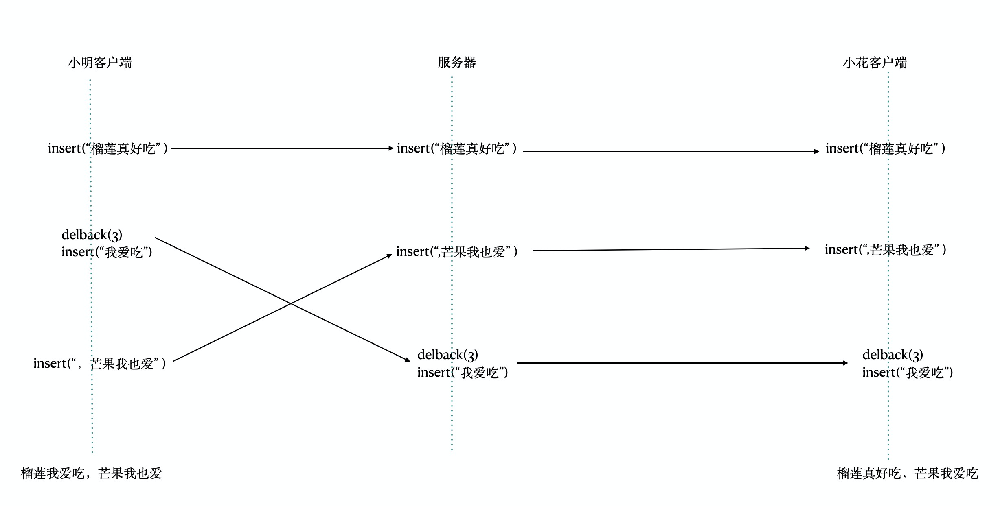
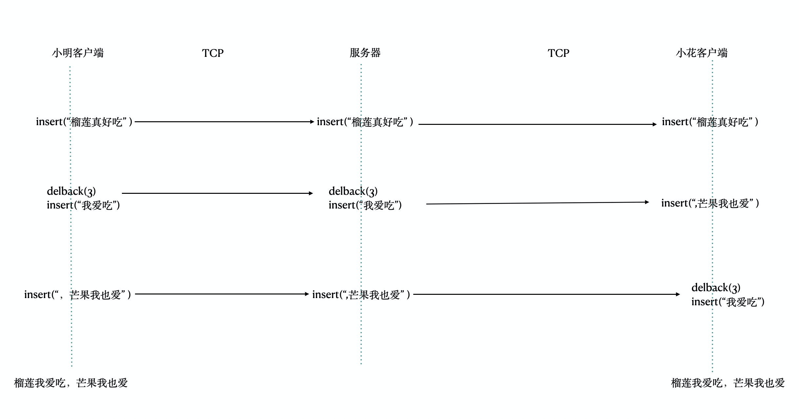
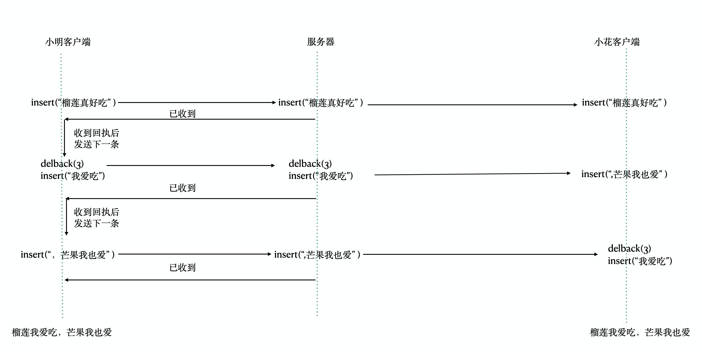
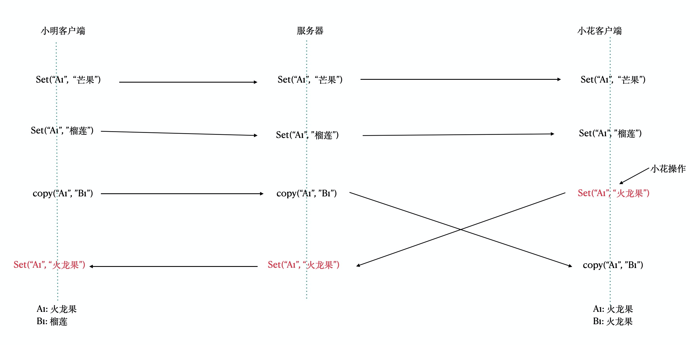

# 多人在线协作方案预研

## 多人协作的形式

### 静态的多人协作

- 递增式协作
  - 邮件
  - 论坛
- 独占式协作
  - 文档传递
  - 微软VSS
- 合并式协作
  - SVG
  - Git
  - diff，patch，merge指令

### 从静态到动态

- 静态协作的比喻
  - 拼接画
  - 积木
- 静态协作的特点
  - 多版本
  - 块操作
  - 有协作动作
- 静态协作的缺点
  - 版本碎片化
  - 缺乏时效性
  - 协作动作成本高

### 动态的多人协作

- 动态协作的比喻
  - 一起画黑板
- 动态协作的特点
  - 唯一版本
  - 原子操作
  - 无协作动作
- 动态协作的优点
  - 版本可控
  - 实时
  - 无协作成本
- 典型产品
  - Office Online
  - 石墨
  - 飞书

## 多人协作的基础原理

### 原理与架构

任何的信息，无论什么展现形式，要做到多人实时编辑与展现，其实只需要以下三步而已

1. 操作化
2. 可传输
3. 可还原

### 操作化

操作化，指任何信息都可以转换为一组操作的集合。很容易理解，但它仍有不少值得思考的点：

- 分割与组合
  - 如何保证：信息的所有变化都可以分解为操作的集合？反之，操作如何覆盖出信息的所有变化？
  - 分割的颗粒度如何决定？
    - 粗一点？
    - 细一点？
    - 如何兼顾解释性与扩展性？
- 绝对操作与相对操作
  - 绝对操作
    - 针孔打印机的完美世界
    - 打印机时代的编辑噩梦
  - 相对操作
    - 4K电视不是梦(绝对帧和相对帧)
    - 为什么数字电视稳定性不如模拟电视

1. - 绝对操作与相对操作比喻：时间与空间的互换(效率和存储的互换)

 

### 可传输

可传输，就是指操作有办法通过网络传输给其他终端。实现动态多人协作，需要考虑以下几点：

- 传输内容
  - 原始文本
    - 清晰
    - 冗余
  - 压缩技术
    - 逻辑压缩
    - 协议压缩
    - 手动压缩
- 网络协议
  - Socket
    - TCP
    - UDP
  - HTTP
  - WebSocket
- Qos(Quality of Service)
  - 快速失败
  - 自动回滚
  - 自动重连
  - 自动恢复

### 可还原

可还原，就是指接收到来自网络的操作消息后，可以在本地完全一致地再次执行该操作。可还原包括了：

- 绝对操作的还原
  - 控制体积
  - 合理的提示
- 相对操作的还原
  - 严格的顺序性
  - 从源头保障顺序性
  - 顺序性的补救
- 本地操作的还原
  - 过滤收到的操作集合
  - 从源头细化操作颗粒
  - 本地保存本地执行
- 无入侵的还原
  - 定义入侵
  - 排除入侵
  - 千人千面

## 多人协作的难点：乱序与冲突

### 乱序

乱序的表现形式如下图，小明在客户端执行了一系列操作，传递到服务器时发生乱序，导致小花看到了截然不同的信息：

### 用性能换取顺序正确--基于协议

### 用性能换取顺序正确--基于回执

### 两种方法的优缺点

#### 基于协议

- 优点
  - 可靠，历经考验
  - 简单，无需开发
- 缺点
  - 资源开销高
  - 必须整套使用

#### 基于回执

- 优点
  - 自主可控，按需开发
  - 资源开销可控
- 缺点
  - 需要自己投入开发
  - 应用层逻辑控制使得网络复杂度向外蔓延
  - 复杂度带来维护成本

总结：网络不是绝对可靠的，为了实现相对可靠，需要付出一定的代价，企业需要考虑的是：如何衡量所付出的代价与产出成正比。

### 冲突

比乱序更高级的一种表现形式，存在多向、多维度等问题。

### 如何避免错误的蔓延？

原则：任何一次不一致，都会导致后续的操作基于错误的信息进行，从而不断扩大错误，造成无法收拾的结果。**因此，不一致是不能被容忍的。**

解决方案：

- 严格一致性：独占
- 最终一致性：检查与修复（体验非常好）
- 非技术手段：设计与提示

### 严格一致性

独占就是同一时间同一范围只能由一人操作。

- 范围
  - 整个表格，类似VSS
  - 工作表
  - 单元格范围
- 排他性
  - 独占冲突时，必有一方被弹开
  - 直到占有者解开，不然无法占用
  - 占用前无法操作
  - 原理和锁基本一致
- 优点
  - 可以确保严格一致性，不会产生多版本的错误累积
  - 比起修复恢复这类弥补手段，一开始就不出错的成本最低
  - 逻辑清楚简单，开发维护成本低
- 缺点
  - 静态协作的味道
  - 独占动作严重影响体验
  - 大幅降低协作效率
- 需要对表格实现的功能
  - 锁定工作表
  - 锁定单元格

### 最终一致性

基于唯一正确顺序，察觉客户端的错误，撤销错误操作后重新执行正确的操作。

- 唯一正确

- 1. 服务器到达顺序
  2. 协作边界分流(同一个协作放在同一个服务器上)
  3. P2P+选举算法

- 察觉错误

- 1. 服务器回执id
  2. 服务器回执操作(Master-Slave模式)

- 撤销错误

- 1. 撤销到错误发生前的一步操作的结果
  2. 保存副本实现撤销功能
  3. 利用操作版本快照

- 重新执行

- 1. 操作队列需保存
  2. 区分好无感知执行与显式执行

### 非技术手段

技术手段追求错误0发生，而非技术手段则可以降低错误发生的可能性

- 选中框
  - 非常重要但不显眼
  - 人性化的独占
  - 操作的预期
  - 协作感
- 协作设计
  - 设计协作区域与合并手段
  - 设置权限
  - 提供工作表和单元格锁定功能
- 单向协作
  - 区分单向与双向协作的场景
  - 对单向协作尽量放开
  - 对双向协作严谨设计

