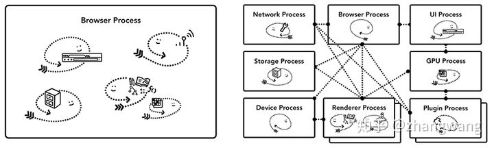
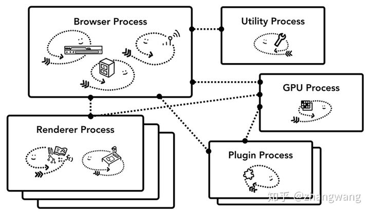
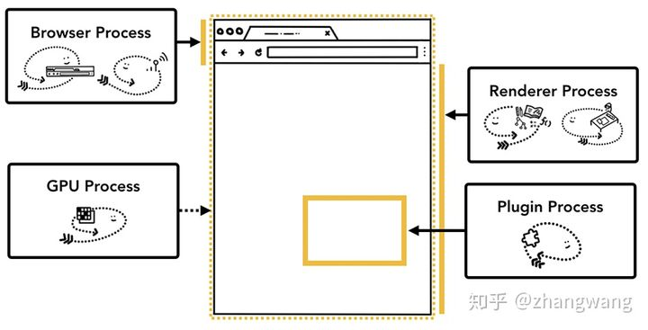
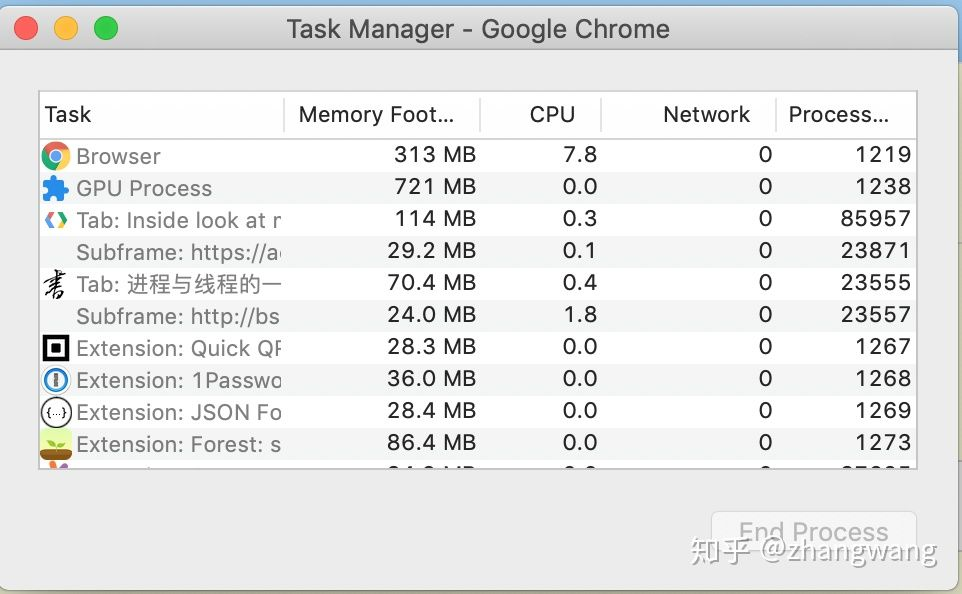
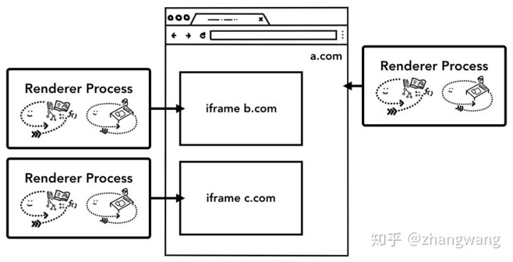

## 浏览器的多进程架构

一个好的程序常常被划分为几个相互独立又彼此配合的模块，浏览器也是如此，以 Chrome 为例，它由多个进程组成，每个进程都有自己核心的职责，它们相互配合完成浏览器的整体功能，每个进程中又包含多个线程，一个进程内的多个线程也会协同工作，配合完成所在进程的职责。

对一些前端开发同学来说，进程和线程的概念可能会有些模糊，为了更好的理解浏览器的多进程架构，这里我们简单讨论一下进程和线程。

### 进程（process）和线程（thread）

当我们启动一个应用，计算机会创建一个进程，操作系统会为进程分配一部分内存，应用的所有状态都会保存在这块内存中，应用也许还会创建多个线程来辅助工作，这些线程可以共享这部分内存中的数据。如果应用关闭，进程会被终结，操作系统会释放相关内存。

一个进程还可以要求操作系统生成另一个进程来执行不同的任务，系统会为新的进程分配独立的内存，两个进程之间可以使用 IPC （Inter Process Communication）进行通信。很多应用都会采用这样的设计，如果一个工作进程反应迟钝，重启这个进程不会影响应用其它进程的工作。

### **浏览器的架构**

有了上面的知识做铺垫，我们可以更合理的讨论浏览器的架构了，其实如果要开发一个浏览器，它可以是单进程多线程的应用，也可以是使用 IPC 通信的多进程应用。

不同浏览器采用了不同的架构模式，这里并不存在标准，本文以 Chrome 为例进行说明 ：

Chrome 采用多进程架构，其顶层存在一个 Browser process 用以协调浏览器的其它进程。

具体说来，Chrome 的主要进程及其职责如下：

- Browser Process：

1. 负责包括地址栏，书签栏，前进后退按钮等部分的工作；
2. 负责处理浏览器的一些不可见的底层操作，比如网络请求和文件访问；

- Renderer Process：

1. 负责一个 tab 内关于网页呈现的所有事情

- Plugin Process：

1. 负责控制一个网页用到的所有插件，如 flash

- GPU Process

1. 负责处理 GPU 相关的任务

Chrome 还为我们提供了「任务管理器」，供我们方便的查看当前浏览器中运行的所有进程及每个进程占用的系统资源，右键单击还可以查看更多类别信息。

通过「页面右上角的三个点点点 --- 更多工具 --- 任务管理器」即可打开相关面板，

**Chrome 多进程架构的优缺点**

**优点**

1. 某一渲染进程出问题不会影响其他进程
2. 更为安全，在系统层面上限定了不同进程的权限

**缺点**

由于不同进程间的内存不共享，不同进程的内存常常需要包含相同的内容。

为了节省内存，Chrome 限制了最多的进程数，最大进程数量由设备的内存和 CPU 能力决定，当达到这一限制时，新打开的 Tab 会共用之前同一个站点的渲染进程。

Chrome 把浏览器不同程序的功能看做服务，这些服务可以方便的分割为不同的进程或者合并为一个进程。以 Broswer Process 为例，如果 Chrome 运行在强大的硬件上，它会分割不同的服务到不同的进程，这样 Chrome 整体的运行会更加稳定，但是如果 Chrome 运行在资源贫瘠的设备上，这些服务又会合并到同一个进程中运行，这样可以节省内存，示意图如下。

**iframe 的渲染 -- Site Isolation**

在上面的进程图中我们还可以看到一些进程下还存在着 Subframe，这就是 Site Isolation 机制作用的结果。

Site Isolation 机制从 Chrome 67 开始默认启用。这种机制允许在同一个 Tab 下的跨站 iframe 使用单独的进程来渲染，这样会更为安全。

> Site Isolation 被大家看做里程碑式的功能， 其成功实现是多年工程努力的结果。Site Isolation 不是简单的叠加多个进程。这种机制在底层改变了 iframe 之间通信的方法，Chrome 的其它功能都需要做对应的调整，比如说 devtools 需要相应的支持，甚至 Ctrl + F 也需要支持。关于 Site Isolation 的更多内容可参考下述链接

