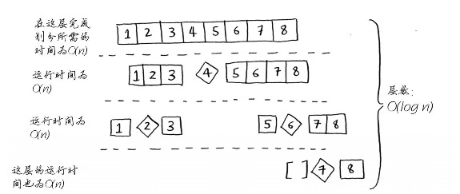

# 算法图解

## 第一章	算法简介

### 1.1	引言

### 1.2	二分查找

二分查找是一种算法，其输入是一个有序的元素列表。如果查找的元素包含在列表中，二分查找返回其位置；否则返回null。

```python
def binary_search(list, item):
    low = 0
    high = len(list) - 1

    while low < high:
        mid = int((low + high) / 2)
        guess = list[mid]
        if guess == item:
            return mid
        if guess > item:
            high = mid - 1
        else:
            low = mid + 1
    return None
```

#### 1.2.2	运行时间

简单查找的运行时间为线性时间，二分查找的运行时间为对数时间。

### 1.3	大O表示法

#### 1.3.1	算法的运行时间以不同的速度增加

大O表示法并不表示具体的执行时间，而是让你能够比较操作数，它指出了算法运行时间的增速。

#### 1.3.3	大O表示法指出了最糟情况下的运行时间

#### 1.3.4	一些常见的大O运行时间

- $O(log\,n)$，也叫对数时间，这样的算法包括二分查找
- $O(n)$，也叫线性时间，这样的算法包括简单查找
- $O(n*log\,n)$，这样的算法包括快速排序--一种速度较快的排序算法
- $O(n^2)$，这样的算法包括选择排序--一种速度较慢的排序算法
- $O(n!)$，这样的算法包括旅行商问题的解决方案--一种非常慢的算法

#### 1.3.5	旅行商


## 第二章	选择排序

### 2.1	内存的工作原理

需要将数据存储到内存时，你将请求计算机提供存储空间，计算机给你一个存储地址。需要存储多项数据时，有两种基本方式--数组和链表。

### 2.2	数组和链表

数组是最基本的数据结构，所开辟的内存空间是连续的，且内存大小一经确定之后便无法再更改，以上两点也成为数组的缺点：浪费内存，缺乏弹性。而也因为开辟的内存空间是连续的，这也成为它的一个优点：查找速度快。数组的另外一个缺点就是：增添和删除的效率低。

链表在某些地方上就和数组相反，存储数据的内存不需要是连续的，链表中的数据可以存储在内存的任何地方。链表的优点为：存储灵活，添加和删除元素十分方便。链表的缺点为：查找元素麻烦。

#### 数组和链表操作的运行时间：

|      | 数组 | 链表 |
| ---- | ---- | ---- |
| 查找 | O(1) | O(n) |
| 插入 | O(n) | O(1) |
| 删除 | O(n) | O(1) |

#### 2.3	选择排序

```python
def findsmallest(arr):
    smallest = arr[0]
    smallest_index = 0
    for i in range(1, len(arr)):
        if arr[i] < smallest:
            smallest = arr[i]
            smallest_index = i
    return smallest_index

def selectionSort(arr):
    newArr = []
    for i in range(len(arr)):
        smallest = findsmallest(arr)
        newArr.append(arr.pop(smallest))
    return newArr
```


## 第三章	递归

### 3.1	递归

如果使用循环，程序的性能可能更高；如果使用递归，程序可能更容易理解。如何选择要看什么对你来说更重要。

### 3.2	基线条件和递归条件

每个递归函数都有两部分：基线条件(base case)和递归条件(recursive case)。

### 3.3	栈

#### 3.3.1	调用栈

计算机在内部使用调用栈的栈。调用另外一个函数时，当前函数暂停并处于未完成状态，该函数的所有变量的值都还在内存中。

#### 3.3.2	递归调用栈

使用栈虽然很方便，但是也要付出代价：存储详尽的信息可能占用大量的内存。


## 第四章	快速排序

### 4.1	分而治之

### 4.2	快速排序

```python
def quicksort(arr):
    if len(arr) < 2:
        return arr
    else:
        pivot = arr[0]
        less = [i for i in arr[1:] if i <= pivot]
        greater = [i for i in arr[1:] if i > pivot]
        return quicksort(less) + [pivot] + quicksort(greater)
    
print(quicksort([5, 3, 6, 2, 10, 1, 4, 7, 8, 9]))
```

### 4.3	快速排序的速度

快速排序的独特之处在于，其速度取决于选择的基准值。在平均情况下，快速排序的运行时间为$O(n\;log\;n)$，在最糟的情况下，其运行时间为$O(n^2)$。

#### 4.3.1	比较合并排序和快速排序



## 第五章	散列表(Hash Table)

### 5.1	散列函数

散列函数将输入映射到数字，且必须满足以下两个要求：

1. 它必须是一致的。每次输入同样的值，得到的数字应保持一致。
2. 它应将不同的输入映射到不同的数字。

散列表由键和值组成，散列表将键映射到值，而键由散列函数生成。

### 5.2	应用案例

#### 5.2.1	将散列表用于查找

#### 5.2.2	防止重复

```python
voted = {}

def check_voted(name):
    if voted.get(name):
        print("kick your ass again")
    else:
        voted[name] = True
        print("kick your ass")


check_voted("rico")
check_voted("rico")
```

#### 5.2.3	将散列表用作缓存

```python
cache = {}

def get_page(url):
    if cache.get(url):
        return cache[url]
    else:
        data = get_data_from_server(url)
        cache[url] = data
        return data
```

### 5.3	冲突

当存储的位置出现冲突的时候：如果两个键映射到了同一个位置，就在这个位置存储一个链表。

- 散列函数很重要，最理想的情况是，散列函数将键均匀地映射到散列表的不同位置
- 如果散列表存储的链表很长，散列表的速度将急剧下降。


### 5.4	性能

|      | 散列表（平均情况） | 散列表（最糟情况） | 数组 | 链表 |
| ---- | ------------------ | ------------------ | ---- | ---- |
| 查找 | O(1)               | O(n)               | O(1) | O(n) |
| 插入 | O(1)               | O(n)               | O(n) | O(1) |
| 删除 | O(1)               | O(n)               | O(n) | O(1) |

#### 5.4.1	填装因子

$$
填装因子=\frac{散列表包含的元素数}{位置总数}
$$

填装因子越低，发生冲突的可能性就越小，散列表的性能就越高。一旦填充因子高于某个阈值，就应该调整散列表的长度：创建一个更长的新数组，使用函数hash将所有的元素都插入到这个新的散列表中。

#### 5.4.2	良好的散列函数

良好的散列函数让数组中的值呈均匀分布，糟糕的散列函数让值扎堆，导致大量的冲突。


## 第六章	广度优先搜索

### 6.1	图简介

解决最短路径问题的算法被称为广度优先搜索。

### 6.2	图是什么

一张图$G$是一个二元组$(V,E)$，其中$V$称为顶点集，$E$称为边集。它们亦可写成$V(G)$和$E(G)$。$E$的元素是一个二元数组对，用$(x,y)$表示，其中$x,y\in V$。

### 6.3	广度优先搜索

广度优先搜索是一种用于图的查找算法，可帮助回答两类问题：

1. 从节点A出发，有前往节点B的路径吗？
2. 从节点A出发，前往节点B的哪条路径最短？

#### 6.3.1	查找最短路径

按添加顺序进行查找，在查找完第一层关系后，再按添加顺序查找第二层关系，这样才能实现找到最短路径的目标。

#### 6.3.2	队列

队列只支持两种操作：入队和出队。队列是一种先进先出的数据结构，而栈是一种后进先出的数据结构。

### 6.4	实现图


