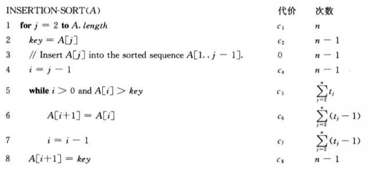

# 算法导论

## 第一章	算法在计算中的作用

### 1.1	算法

算法就是任何良定义的计算过程，该过程取某个值或值的集合作为输入并产生某个值或值的集合作为输出。

若对每个输入实例算法都以正确的输出停机，则称算法是正确的，并称正确的算法解决了给定的计算问题。不正确的算法对某些输入实例可能根本不停机，也可能以不正确的回答停机。

算法问题所共有的两个特征：

1. 存在许多候选解，但绝大多数候选解都没有解决手头的问题。
2. 存在实际应用。

**数据结构**

数据结构是一种存储和组织数据的方式，旨在便于访问和修改。

**并行性**

为了从多核计算机获得最佳的性能，设计算法时必须考虑并行性。


### 1.2	作为一种技术的算法

**效率**

为求解相同问题而设计的不同算法在效率方面常常具有显著的差别。这些差别可能比由于硬件和软件造成的差别要重要得多。

**算法与其他技术**

整个系统的性能不但依赖于选择快速的硬件而且还依赖于选择有效的算法。

## 第二章	算法基础

### 2.1	插入排序

**输入：**n个数的一个序列$\langle a_1,a_2,\cdots,a_n\rangle$

**输出：**输入序列的一个排列$\langle a_1^\prime,a_2^\prime,\cdots,a_n^\prime \rangle$，满足$a_1^\prime\le a_2^\prime\le\cdots\le a_n^\prime$

```c++
#include <iostream>
#include <vector>

using namespace std;

void Insert_Sort(vector<int> &arr);

int main() {
    
    vector<int> arr = { 2,8,6,7,1,10,5,3,9,4 };
        
    for (const auto num : arr) {
        cout << num << " ";
    }
    cout << endl;
    
    Insert_Sort(arr);
    
    for (const auto num : arr) {
        cout << num << " ";
    }
    cout << endl;
    
    return 0;
}

void Insert_Sort(vector<int> &arr) {
    vector<int> result = { arr[0] };
    arr.erase(arr.begin());
    
    for (const auto num : arr) {
        bool inserted = false;
        for (auto nowIter = result.rbegin(); nowIter != result.rend(); ++nowIter) {
            if (num > *nowIter) {
                inserted = true;
                auto insertIter = nowIter.base();
                result.insert(insertIter, num);
                break;
            }
        }
        if (!inserted) {
            cout << num << endl;
            result.insert(result.begin(), num);
        }
    }
    
    arr = result;
}

```

### 2.2	分析算法

我们假定一种通用的单处理器计算模型----随机访问机（random-access machine, RAM）来作为我们的实现技术，算法可以用计算机程序来实现。RAM模型包含真实计算机中常见的指令：算术指令（如加法、减法、乘法、除法、取余、向下取整、向上取整）、数据移动指令（装入、存储、复制）和控制指令（条件与无条件转移、子程序调用与返回）。每条这样的指令所需时间都为常量。RAM模型中的数据类型有整数型和浮点型。在RAM模型中，我们并不试图对当代计算机中场景的内存层次进行建模。也就是说，我们没有对高速缓存和虚拟内存进行建模。

**插入排序算法的分析**

一个算法在特定输入上的运行时间是指执行的基本操作数或步数。



在最好情况下，运行时间是$n$的线性函数。在最坏情况下，运行时间是$n$的二次函数。

**最坏情况与平均情况分析**

往往研究集中于只求最坏情况时间，理由如下：

- 一个算法的最坏运行时间给出了任何输入的运行时间的一个上界。
- 对某些算法，最坏情况经常出现。
- 平均情况往往与最坏情况大致一样差。

**增长量级**

我们真正感兴趣的是运行时间的增长率或增长量级。所以会忽略掉低阶项和最重要的项的常系数。

### 2.3	设计算法

#### 2.3.1	分治法

分治法的思想：将原问题分解为几个规模较小但类似于原问题的子问题，递归地求解这些子问题，然后再合并这些子问题的解来建立原问题的解。

分治模式在每层递归时都有三个步骤：

1. 分解原问题为若干子问题。
2. 解决这些子问题，递归地求解各子问题。然而，若子问题的规模足够小，则直接求解。
3. 合并这些子问题的解称原问题的解。

**归并排序**

```c++

```

