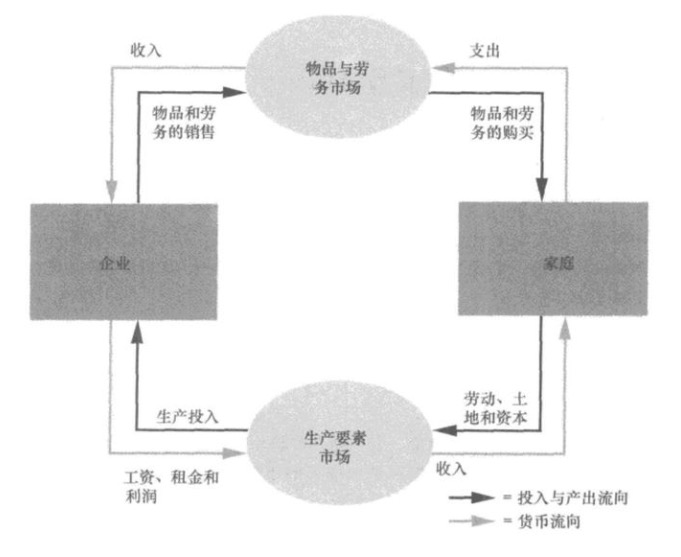

# 经济学十大原理

稀缺性：社会拥有的资源是有限的，因此不能生产人们希望拥有的所有物品与服务。

经济学研究社会如何管理自己的稀缺资源。

## 人们如何做出决策

### 原理一：人们面临权衡取舍

社会面临的一种权衡取舍是在效率与平等之间。在设计政府政策的时候，这两个目标往往是不一致的。

### 原理二：某种东西的成本是为了得到它所放弃的东西

一种东西的机会成本是为了得到这种东西所放弃的东西。

### 原理三：理性人考虑边际量

经济学家通常假设，人是理性的。在可用的机会为既定的条件下，理性人系统而有目的地尽最大努力去实现其目标。“边际”指“边缘”，边际变动是围绕你所做的事的边缘的调整。理性人通常通过比较边际收益与边际成本来做决策。当且仅当一种行为的边际收益大于边际成本时，一个理性决策者才会采取这种行动。

### 原理四：人们会对激励做出反应

激励是引起一个人做出某种行为的某种东西。由于理性人通过比较成本与收益做出决策，所以，他们会对激励做出反应。在经济学研究中，激励起着中心作用。

## 人们如何相互影响

### 原理五：贸易可以使每个人的状况都变得更好

### 原理六：市场通常是组织经济活动的一种好方法

市场经济：当许多企业和家庭在物品与服务市场上相互交易时，通过他们的分散决策配置资源的经济。价格就是“看不见的手”用来指引经济活动的工具。作为买者与卖者决策的结果，市场价格既反映了一种物品的社会价值，也反映了生产该物品的社会成本。价格会自发调整，指引这些单个买者和卖者达到某种结果，该结果在大多数情况下会实现整个社会福利的最大化。

### 原理七：政府有时可以改善市场结果

只有在政府实施规则并维持对市场经济至关重要的制度时，“看不见的手”才能施展其魔力。最重要的是，市场经济需要实施产权的制度，以便个人可以拥有和控制稀缺资源。政府干预经济并改变人们自己选择的资源配置的原因有两类：促进效率或促进平等。

## 整体经济如何运行

### 原理八：一国的生活水平取决于它生产物品与服务的能力

几乎所有生活水平的差别都可以归因于各国生产率的差别----即每一单位劳动投入所生产的物品与服务数量的差别。生产率是生活水平的首要决定因素，其他因素都是次要的。

### 原理九：当政府发行了过多货币时，物价上升

### 原理十：社会面临通货膨胀与失业之间的短期权衡取舍

货币注入的短期效应：

- 经济中货币量增加刺激了社会的整体支出水平，从而增加了对物品与服务的需求。
- 需求的增加随着时间推移，会引起企业提高物价，但同时，它也鼓励企业雇用更多的工人，并生产更多的物品与服务。
- 雇用更多的工人意味着更少的失业。

# 像经济学家一样思考

## 作为科学家的经济学家

科学的本质是科学方法--冷静地建立并检验有关世界如何运行的各种理论。科学方法同样适用于经济学。

### 科学方法：观察、理论和进一步观察

科学方法就是理论与观察的相互作用，这种作用也发生在经济学领域中。但是在经济学研究中，进行实验往往是不可能的。所以经济学家十分关注历史所提供的自然实验。

### 假设的作用

假设可以使复杂的世界简单化，从而使解释这个世界变得更为容易。经济学家用不同的假设来回答不同的问题。

### 经济模型

经济学家研究用图形和方程组成的模型，经济模型忽略了许多细节，以便使我们了解真正重要的东西。

### 我们的第一个模型：循环流量图

循环流量图：一个说明货币如何通过市场在家庭与企业之间流动的直观经济模型。

### 我们的第二个模型：生产可能性边界

生产可能性边界：表示在可得到的生产要素与生产技术既定时；一个经济所能生产的产品数量的各种组合的图形。

### 微观经济学与宏观经济学

微观经济学：研究家庭和企业如何做出决策，以及它们如何在市场上相互交易的学科。

宏观经济学：研究整体经济现象，包括通货膨胀、失业和经济增长的学科。

### 作为政策顾问的经济学家

### 实证分析与规范分析

